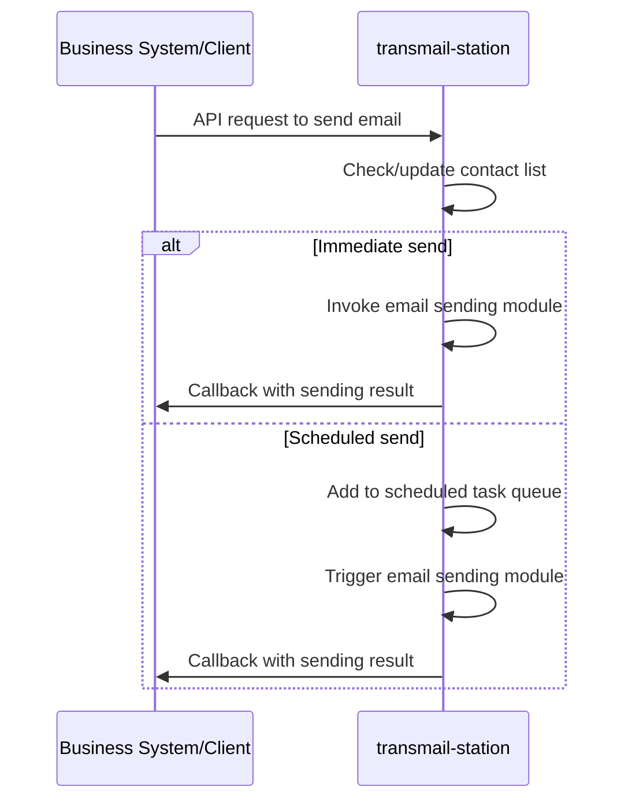

TransMail-Station
===

[简体中文](./README.zh-CN.md)

# Introduction

TransMail Station is a mail management service based on HTTP interfaces, designed to help business code send and manage emails via HTTP requests. This decouples the email-sending functionality from core business logic.

* Features:
  * Multi-recipient email sending (load balancing)
  * Specified sending services
  * Scheduled sending
  * RESTful API
  * Deployment with Docker Compose
* Use Cases:
  * As a microservice for centralized email sending
  * Suitable for projects that need to separate email-sending functionality from main business logic
  * Provides simple and easy-to-use interfaces, reducing development complexity and accelerating business development

## Communication Flow


# Quick Start

```yaml
services:
  transmail-station:
    image: ghcr.io/qqays/transmail-station:latest  # use github packages image
#    image: qqays/transmail-station:latest  # use dockerhub image
    container_name: transmail-station
#    environment:
#      - TZ=Asia/Shanghai
    logging:
      driver: "json-file"
      options:
        max-size: "1g"
    volumes:
      - ./config.yml:/usr/src/transmail-station/config/config.yml
      - ./logs:/usr/src/transmail-station/logs
    ports:
      - "8100:8100"
    healthcheck:
      test: [ "CMD", "curl", "-f", "http://localhost:8100/health" ]
      interval: 30s
      timeout: 10s
      retries: 3
      start_period: 5s
    restart: on-failure
```

## 1. Create Folders
```shell
mkdir TransMail-Station && cd TransMail-Station
```

## 2. Pull Configuration and `docker-compose.yml`
```shell
wget -O ./config.yml https://raw.githubusercontent.com/qqAys/TransMail-Station/refs/heads/main/config/config.example.yml
wget -O ./docker-compose.yml https://raw.githubusercontent.com/qqAys/TransMail-Station/refs/heads/main/docker-compose.yml
```

## 3. Edit Configuration
```shell
vim ./config.yml
```

For configuration details, see [config.example.yml](./config/config.example.yml).

## 4. Start the Container
```shell
docker compose up -d
```

## 5. Use the API
Visit [TransMail-Station - Swagger UI](http://localhost:8100/docs) to view the API documentation and integrate it into your business code.

# Local Build

## 1. Clone the Project and Modify Configuration
```shell
# Clone the project
git clone https://github.com/qqAys/TransMail-Station.git
cd TransMail-Station

# Modify configuration
mv ./config/config.example.yml ./config/config.yml
vim ./config/config.yml
```

For configuration details, see [config.example.yml](./config/config.example.yml).

## 2. Build and Start the Container Using `docker-compose.build.yml`
```shell
docker-compose up -d
```

# License
This project is licensed under the [MIT License](./LICENSE).
