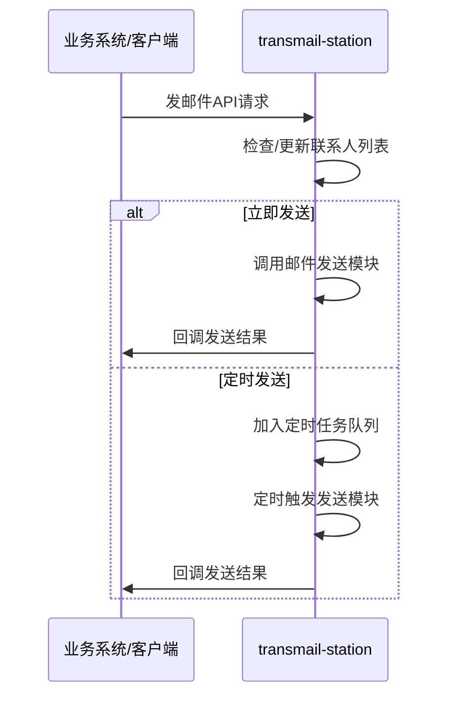

TransMail-Station
===

[English](./README.md)

# 简介

TransMail Station 是一个基于 HTTP 接口的邮件管理服务，旨在帮助业务代码通过 HTTP 请求发送与管理发送邮件，从而实现邮件发送功能与业务逻辑的解耦。

* 特性：
  * 多联系人邮件发送（负载均衡）
  * 指定发送服务
  * 定时发送
  * RESTful API
  * docker compose 部署
* 适用场景：
  * 作为邮件发送中心的微服务
  * 适用于需要将邮件发送功能从主业务逻辑中分离的项目。
  * 提供简单易用的接口，降低业务开发复杂度，提升业务开发速度。

## 通信流程


# 快速开始

```yaml
services:
  transmail-station:
    image: ghcr.io/qqays/transmail-station:latest  # 使用 github packages 镜像
#    image: qqays/transmail-station:latest  # 使用 dockerhub 镜像
    container_name: transmail-station
#    environment:
#      - TZ=Asia/Shanghai
    logging:
      driver: "json-file"
      options:
        max-size: "1g"
    volumes:
      - ./config.yml:/usr/src/transmail-station/config/config.yml
      - ./logs:/usr/src/transmail-station/logs
    ports:
      - "8100:8100"
    healthcheck:
      test: [ "CMD", "curl", "-f", "http://localhost:8100/health" ]
      interval: 30s
      timeout: 10s
      retries: 3
      start_period: 5s
    restart: on-failure
```

## 1. 创建文件夹
```shell
mkdir -p TransMail-Station/config && cd TransMail-Station
```

## 2. 拉取配置与 `docker-compose.yml` 
```shell
wget -O ./config.yml https://raw.githubusercontent.com/qqAys/TransMail-Station/refs/heads/main/config/config.example.yml
wget -O ./docker-compose.yml https://raw.githubusercontent.com/qqAys/TransMail-Station/refs/heads/main/docker-compose.yml
```

## 3. 编辑配置
```shell
vim ./config.yml
```

配置说明详见 [config.example.yml](./config/config.example.yml)

## 4. 启动容器
```shell
docker compose up -d
```

## 5. 使用API
访问 [TransMail-Station - Swagger UI](http://localhost:8100/docs)，查看API文档并集成到业务代码中。

# 本地构建

## 1. 克隆项目，修改配置
```shell
# 克隆项目
git clone https://github.com/qqAys/TransMail-Station.git
cd TransMail-Station

# 修改配置
mv ./config/config.example.yml ./config/config.yml
vim ./config/config.yml
```

配置说明详见 [config.example.yml](./config/config.example.yml)
 
## 2. 使用 `docker-compose.build.yml` 构建并启动容器
```shell
docker-compose up -d
```

# 许可
本项目采用 MIT 许可协议进行许可。
